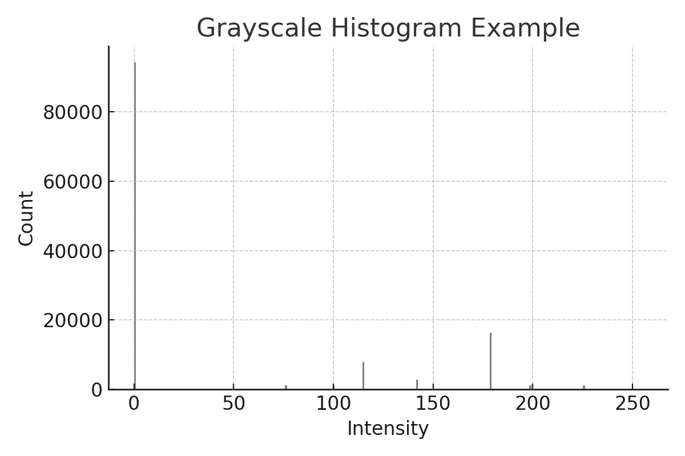
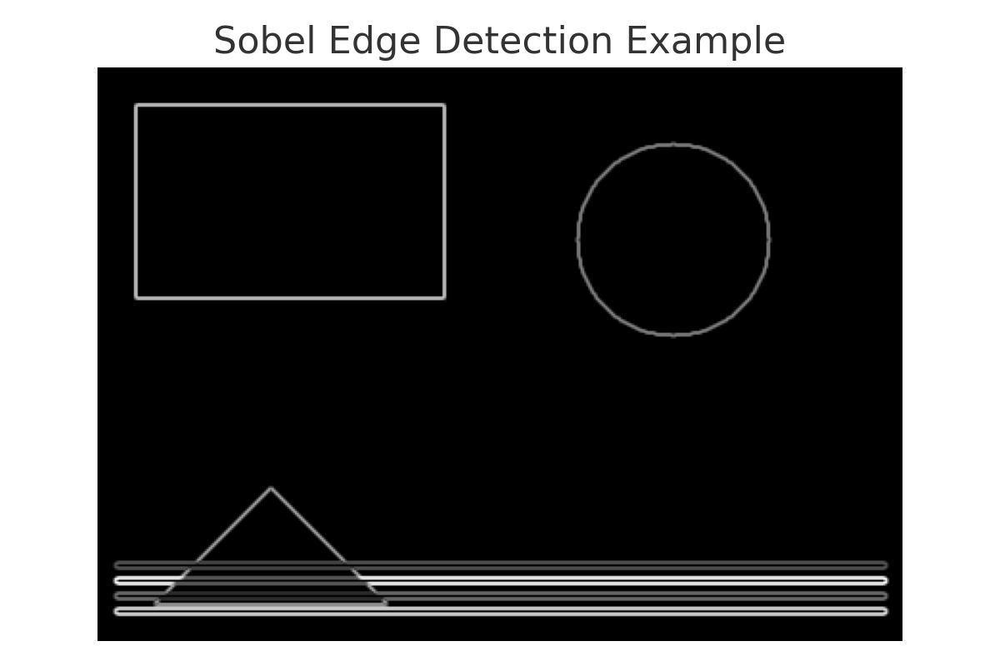

<h1 align="center">Computer Vision Basics</h1>
<h2>Overview</h2>

  This repository contains small-scale computer vision exercises designed for beginners. 
  The tasks demonstrate fundamental image processing concepts using <strong>OpenCV</strong>, 
  <strong>NumPy</strong>, <strong>Matplotlib</strong>, and optionally <strong>Pandas</strong>.

<h2>Notebooks</h2>
<ul>
  <li><code>CV Basics.ipynb</code> — loads three sample images (shapes, landscape, checker/noise), converts to grayscale, plots histograms, performs contrast stretching, and applies Sobel edge detection.</li>
  <li><code>Shapes & Colors.ipynb</code> — programmatically generates a black background image with coloured shapes and a circle, then performs grayscale conversion, histogram analysis, contrast stretching, and Sobel edge detection.</li>
</ul>

<h2>Key Features</h2>
<ul>
  <li>Image loading, viewing, and preprocessing</li>
  <li>Grayscale conversion and histogram visualisation</li>
  <li>Contrast stretching for enhanced visibility</li>
  <li>Edge detection using the Sobel operator</li>
</ul>

<h2>Files</h2>
<ul>
  <li><code>cv_pic_shapes.png</code> — synthetic shapes image</li>
  <li><code>cv_pic_landscape.png</code> — simple landscape scene</li>
  <li><code>cv_pic_checker_noise.png</code> — checkerboard with added noise</li>
  <li><code>cv_pic_black_shapes.png</code> — black background with coloured shapes (generated by Shapes & Colors notebook)</li>
</ul>

<h2>Visualisations</h2>

<strong>Example: Grayscale & Histogram</strong>

<strong>Example: Sobel Edge Detection</strong>

<h2>Methods</h2>
<ul>
  <li><strong>OpenCV</strong> — for image generation, manipulation, and filtering</li>
  <li><strong>NumPy</strong> — array handling and calculations</li>
  <li><strong>Matplotlib</strong> — plotting histograms and visualisations</li>
  <li><strong>Pandas</strong> — optional, used for simple statistics summary</li>
</ul>

