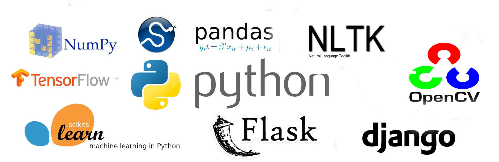

# Python Projects 

This repository contains a collection of Python-based projects focusing on **data cleaning**, **natural language processing (NLP)**, **statistical analysis**, and **basic machine learning**. These projects reflect my applied learning during my Data Science degree at FAST University, Islamabad.

  

## Projects Overview

### 🔹 Data Cleaning & Preprocessing
- Cleaned and transformed medium- to large-scale datasets using `pandas` and `NumPy`.
- Addressed real-world inconsistencies including missing values, irregular formatting, and encoding issues.
- Prepared datasets for downstream machine learning and statistical analysis.

### 🔹 Natural Language Processing (NLP)
- Applied NLP techniques including:
  - Tokenisation, stemming, lemmatisation  
  - Sentiment analysis  
  - Stopword removal for multilingual datasets, including **Urdu**  
- Addressed challenges in Urdu text processing, such as script inconsistencies and non-standard grammar.

### 🔹 Statistical Analysis
- Used Python libraries like `scipy` and `statsmodels` to implement:
  - Hypothesis testing  
  - Regression models  
  - Probability distributions and exploratory data analysis (EDA)

### 🔹 Introductory Machine Learning
- Built basic models for classification and clustering using `scikit-learn`.
- Evaluated model accuracy and performance using appropriate metrics.
- Explored feature engineering and selection techniques.

### 🔹 Image Processing (OpenCV)
- Conducted beginner-level experiments with `OpenCV`, including:
  - Image loading, manipulation, thresholding  
  - Basic filtering and contour detection

## Tech Stack
- **Languages:** Python  
- **Libraries:** pandas, NumPy, matplotlib, scikit-learn, NLTK, OpenCV, scipy  
- **Tools:** Jupyter Notebook, Git, VS Code
<<<<<<< HEAD

## Learning Outcomes
These projects helped reinforce:
- Practical data science workflows  
- Text and image data handling  
- Statistical reasoning and implementation in Python  
- Clear and modular code structuring

<h3>📁 Repository Structure</h3>

<ul>
  <li>
    <strong>data_cleaning/</strong> – Scripts and notebooks for cleaning and preprocessing raw datasets. 
  </li>
  <li>
    <strong>nlp_urdu_sentiment/</strong> – NLP tasks focused on Urdu text processing and sentiment analysis.
  </li>
  <li>
    <strong>statistical_analysis/</strong> – Implementation of statistical tests, regression models, and exploratory data analysis (EDA).
  </li>
  <li>
    <strong>basic_ml_models/</strong> – Introductory machine learning models and evaluation workflows.
  </li>
  <li>
    <strong>opencv_experiments/</strong> – Beginner-level image processing experiments using OpenCV.
  </li>
  <li>
    <strong>README.md</strong> – Project overview and documentation.
  </li>
</ul>
=======
---

*If you find this repository useful or have suggestions for improvement, feel free to fork, open an issue, or leave a ⭐!*
>>>>>>> 4da3fd94ccc6ff552df4b29dee9d5c0658b99fbd
